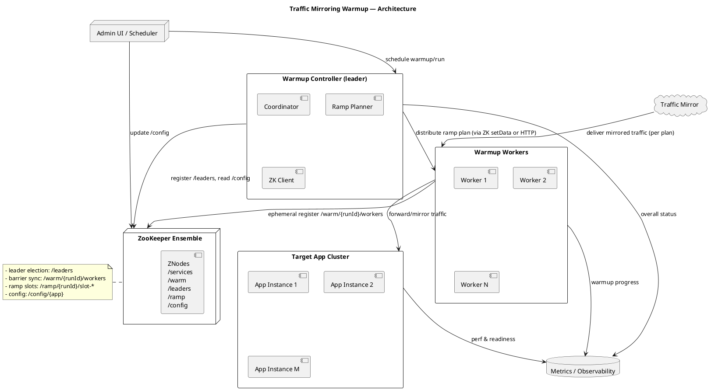

# LoadedService — Cold Start with Memory Mapping (Go)

Мини‑микросервис иллюстрирует эффект cold start: первое чтение данных из файла, отображённого в память (mmap), медленнее последующих после «прогрева» страниц.

## Быстрый старт

- Требуется Go 1.22+
- Запуск (Windows/PowerShell):

```powershell
scripts/run.ps1
```

Или через Makefile:

```bash
make run
```

HTTP:
- `GET /healthz` — liveness
- `POST /warmup` — последовательное чтение страниц (прогрев)
- `GET /bench?samples=2000` — замер random reads до/после прогрева, JSON

## Как прогнать benchmark

- **PowerShell**:

```powershell
# cold + warm в одном вызове
iwr http://localhost:8080/bench?samples=2000 `
  | Select-Object -ExpandProperty Content
```

```powershell
# cold + warm в одном вызове
iwr http://localhost:8080/warmup
```

- **curl (Linux/macOS/Windows)**:

```bash
curl "http://localhost:8080/bench?samples=2000"
```

- **Последовательность для сравнения руками**:
  - 1) Запустить сервис: `make run` или `scripts/run.ps1`
  - 2) Один раз вызвать `/bench` — выведет `cold`, `warm`, `speedup`
  - 3) При желании отдельно прогреть: `POST /warmup`, затем ещё раз `/bench`

## Настройки (env)
- `HTTP_ADDR` (по умолчанию `:8080`)
- `MMAP_FILE` (по умолчанию `data/big.bin`)
- `MMAP_SIZE_MB` (по умолчанию `500`)
- `SAMPLES_DEFAULT` (по умолчанию `1000`)

## Код
- `cmd/coldstart` — точка входа, HTTP сервер, graceful shutdown
- `internal/mmapstore` — управление файлом: create, mmap, touch, измерения
- `internal/httpserver` — хендлеры `/healthz`, `/warmup`, `/bench`, `/config`
- `internal/bench` — сценарий измерения cold vs warm

## Что демонстрируется
1. Создаётся файл заданного размера и мапится в память.
2. `GET /bench` выполняет случайные чтения (cold), затем прогревает страницы и повторяет чтения (warm).
3. В ответе — времена, перцентили и коэффициент ускорения.

## Как получать воспроизводимые результаты

Benchmark чувствителен к состоянию ОС, планировщику, частоте CPU и фоновой нагрузке.
Чтобы результаты были максимально стабильными на конкретной машине:

- **Фиксируйте seed и число прогонов**:
  - `GET /bench?samples=2000&runs=5&seed=42`
  - `samples` — количество случайных чтений за один прогон;
  - `runs` — сколько раз повторить сценарий cold+warm и усреднить результаты;
  - `seed` — начальное значение ГПСЧ, определяющее последовательность страниц (при одинаковых `samples`, `runs`, `seed` и размере файла последовательность будет одинаковой).
- **Интерпретация ответа**:
  - `samples`, `runs`, `seed` — параметры запуска;
  - `cold`, `warm` — среднее время cold/warm (ns) по всем прогонам;
  - `cold_min`, `cold_max`, `warm_min`, `warm_max` — разброс по прогонам;
  - `cold_p95`, `cold_p99`, `warm_p95`, `warm_p99` — перцентили по прогонам;
  - `speedup` и `speedup_*` — средний и агрегированные коэффициенты ускорения.
- **Режим запуска** (рекомендуется):
  - по возможности запускать benchmark на «пустой» машине/VM без посторонних нагрузок;
  - зафиксировать `GOMAXPROCS` (например, `GOMAXPROCS=1` для минимизации влияния планировщика);
  - по возможности отключить aggressive turbo/переключение частоты CPU;
  - повторять серию запросов и смотреть на разброс `*_min`/`*_max` — если он велик, среду лучше «очистить».

## PlantUML — компоненты и ZK‑концепции



## Идеи с ZooKeeper (коротко)
- Регистрация инстансов: `/services/{app}/instances/*` (ephemeral)
- Лидер среди контроллеров: `/leaders/{app}/node-` (ephemeral-sequential, min — лидер)
- Барьер старта прогрева: `/warm/{runId}/workers/*` — ждать N детей
- Плавный разгон RPS: слоты `/ramp/{runId}/slot-*` (порядок = график)
- Конфиги прогрева: `/config/{app}`; подписки на изменения
