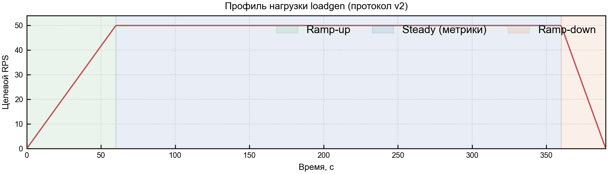
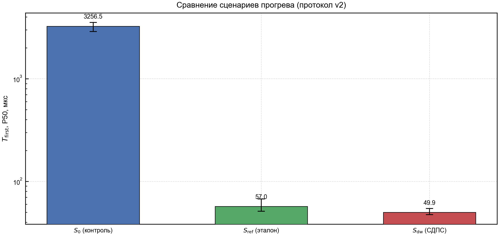
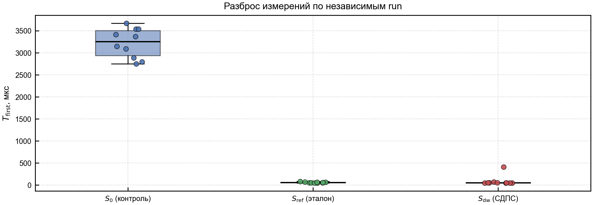
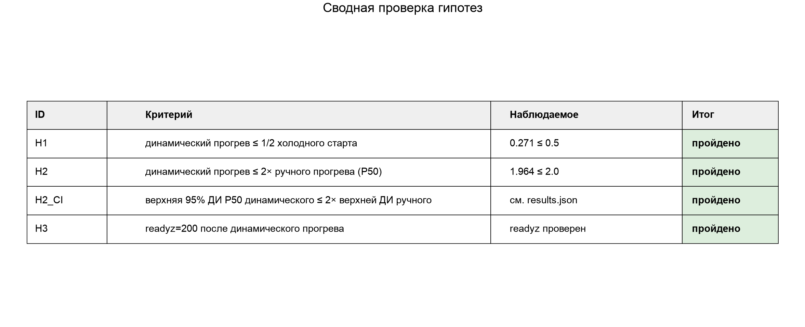
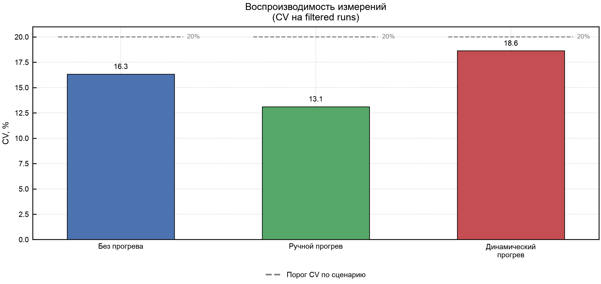
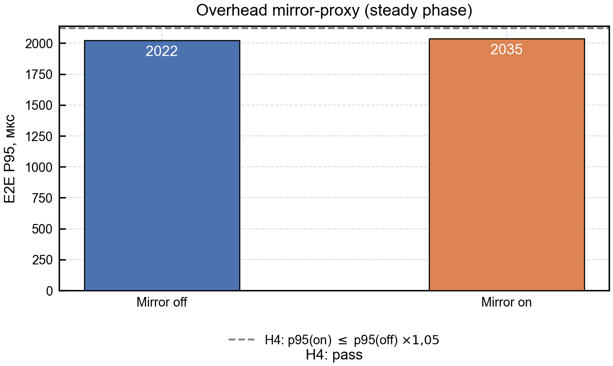
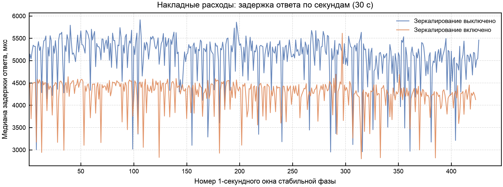

# Benchmark Figures

Каталог графиков для отчёта НИР. Графики генерируются командой:

```bash
make figures
```

Источник данных:

- `results/full/results.json` — сценарии без прогрева, ручной прогрев, динамический прогрев.
- `results/h4/results.json` — overhead зеркалирования.
- `manifest.json` — дата генерации, пути и sha256 исходных `results.json`.

`figures_tmp/` не является источником для отчёта; используйте только этот каталог.

## Figure Catalog

### 1. Профиль нагрузки



Показывает ramp-up, steady и ramp-down. Нужен до результатов, чтобы объяснить, где происходит прогрев и из какого окна берутся метрики.

### 2. Основной эффект по T_first



Главный график результата: сравнивает первый боевой запрос без прогрева, после ручного прогрева и после динамического прогрева СДПС.

### 3. Разброс независимых run



Показывает воспроизводимость `T_first`, filtered set и IQR-выбросы. Нужен, чтобы результат не выглядел как один удачный запуск.

### 4. Проверка гипотез



Сводит H1/H2/H2_CI/H3 в критерии, наблюдаемые значения и verdict.

### 5. Коэффициент вариации



Контроль качества измерений. Использовать в разделе воспроизводимости и ограничений стенда.

### 6. Overhead зеркалирования



Показывает влияние включенного mirror traffic на active path через proxy.

### 7. Диагностика H4



Диагностический график стабильности steady-фазы H4; не должен быть единственным доказательством H4 в финальном отчёте.
